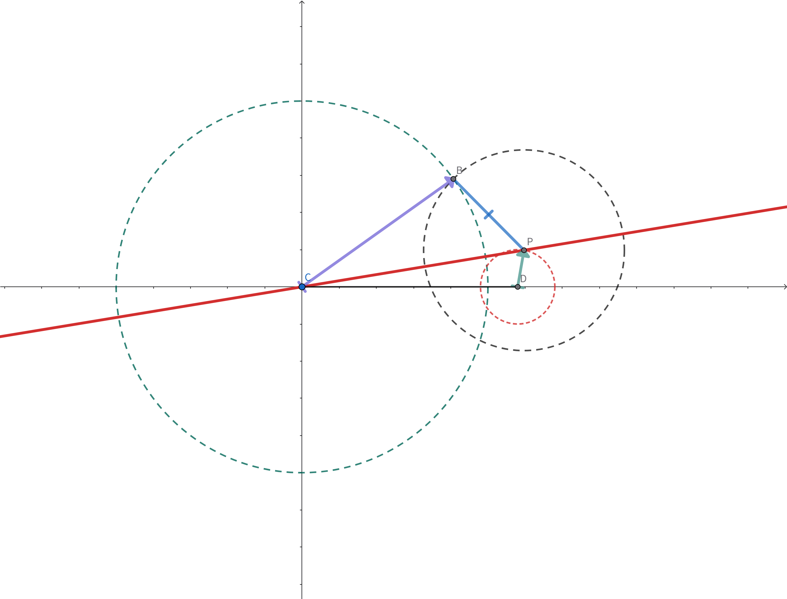

# H题控制系统前馈与机构公式汇总

本文统一车辆运动规划、加速度 IMU 修正、滚球控制、摆杆连杆反解、MG996R 控制和停车控制使用的公式。所有三角函数使用弧度，程序实现前必须统一坐标方向和时间戳。

## 1. 坐标系与符号

### 1.1 正方向

- 车体坐标系 $B$：$x_B$ 轴指向小车前进方向，$z_B$ 轴向上。
- 钢球位置 $x$：从摆杆中心 $O$ 指向车头为正。
- 摆杆角度 $\alpha$：摆杆车头端抬高为正，水平时 $\alpha=0$。
- 舵机角度 $\theta$：舵机摆臂向量 $\overrightarrow{DP}$ 相对车体 $+x_B$ 轴的角度，逆时针为正。
- 车辆纵向加速度 $a_c$：小车向前加速为正。
- 钢球相对摆杆的速度和加速度分别为 $\dot{x}$、$\ddot{x}$。
- 重力加速度 $g=9.80665\text{ m/s}^2$。

安装后必须完成三个符号检查：

1. 钢球向车头移动时，视觉输出 $x$ 增大。
2. 增大 $\alpha$ 时，车头端抬高，钢球向车尾加速。
3. 小车向前加速时，IMU 输出的 $a_c$ 为正。

如果实际方向相反，应在硬件适配层统一乘以方向系数，不要在不同控制公式中分别改符号。

### 1.2 变量表

| 符号 | 含义 | 单位 |
| --- | --- | --- |
| $x_r,\dot{x}_r,\ddot{x}_r$ | 钢球目标位置、速度、加速度 | m, m/s, m/s² |
| $\hat{x},\hat{v}$ | 预测到当前时刻的钢球位置和速度 | m, m/s |
| $u$ | 控制器要求的钢球相对加速度 | m/s² |
| $a_c$ | 车体沿摆杆方向的纵向加速度 | m/s² |
| $\alpha$ | 摆杆相对车体水平面的角度 | rad |
| $\theta$ | 舵机摆臂相对车体水平面的角度 | rad |
| $p$ | 舵机 PWM 高电平脉宽 | us |
| $T_s$ | 滚球控制周期，默认 0.005s | s |
| $\tau_s$ | 舵机等效延迟 | s |
| $\tau_v$ | 视觉测量总延迟 | s |

## 2. 钢球动力学

### 2.1 滚动系数

设钢球质量为 $m$、半径为 $r$、转动惯量为 $I$。纯滚动时：

$$
\lambda=\frac{1}{1+\frac{I}{mr^2}}
$$

钢球近似为实心球：

$$
I=\frac{2}{5}mr^2,\qquad \boxed{\lambda=\frac{5}{7}}
$$

### 2.2 加速车体上的纵向模型

忽略摆杆快速转动产生的高阶项、滚动阻力和结构振动：

$$
\boxed{\ddot{x}=-\lambda\left(g\sin\alpha+a_c\cos\alpha\right)+d_x}
$$

$d_x$ 汇总滚动阻力、车体俯仰、舵机振动、摆杆角运动和模型误差。

小角度且 $|a_c|\ll g$ 时：

$$
\boxed{\ddot{x}\approx-\frac{5}{7}\left(g\alpha+a_c\right)+d_x}
$$

该符号约定下：

- 向前加速 $a_c>0$ 时，钢球相对车体向后运动。
- 为保持钢球不动，需要 $\alpha<0$，即摆杆车头端略微降低。
- 刹车时 $a_c<0$，前馈方向相反。

## 3. 钢球控制与摆杆角前馈

### 3.1 期望钢球加速度

$$
e_x=x_r-\hat{x},\qquad e_v=\dot{x}_r-\hat{v}
$$

$$
\boxed{
u=\ddot{x}_r+K_p e_x+K_d e_v+K_i\int e_x\,dt
}
$$

- $\ddot{x}_r$ 是钢球目标轨迹前馈。第 3 项的 $O\rightarrow+5\text{cm}\rightarrow-5\text{cm}$ 应使用平滑目标轨迹。
- 初次闭环只启用 $K_p,K_d$，稳定后再加入小积分。
- 积分只在视觉有效、误差较小且摆杆未饱和时更新，并进行抗积分饱和。
- $u$ 必须限幅，保证动力学逆解有解且机构不会突然撞限位。

### 3.2 精确逆动力学

令模型期望 $\ddot{x}=u$：

$$
u=-\lambda\left(g\sin\alpha+a_c\cos\alpha\right)
$$

定义：

$$
R=\sqrt{g^2+a_c^2},\qquad \delta=\operatorname{atan2}(a_c,g)
$$

因为：

$$
g\sin\alpha+a_c\cos\alpha=R\sin(\alpha+\delta)
$$

选择靠近水平位置的小角度解：

$$
\boxed{
\alpha_{cmd}=
\arcsin\left[
\operatorname{clip}\left(-\frac{u}{\lambda R},-1,1\right)
\right]
-\operatorname{atan2}(a_c,g)
}
$$

实心钢球代入 $\lambda=5/7$：

$$
\boxed{
\alpha_{cmd}=
\arcsin\left[
\operatorname{clip}\left(
-\frac{7u}{5\sqrt{g^2+a_c^2}},-1,1
\right)
\right]
-\operatorname{atan2}(a_c,g)
}
$$

### 3.3 小角度形式

$$
\boxed{\alpha_{cmd}\approx-\frac{a_c}{g}-\frac{u}{\lambda g}}
$$

对实心钢球：

$$
\boxed{\alpha_{cmd}\approx-\frac{a_c}{g}-\frac{7u}{5g}}
$$

纯车辆加速度前馈：

$$
\boxed{\alpha_{ff,car}=-\operatorname{atan2}(a_c,g)\approx-\frac{a_c}{g}}
$$

向前加速时 $a_c>0$，得到 $\alpha_{ff,car}<0$，方向与车头端需要降低一致。

### 3.4 摆杆指令约束

先限制角度：

$$
\alpha_{lim}=\operatorname{sat}
\left(\alpha_{cmd},-\alpha_{max},\alpha_{max}\right)
$$

再限制每周期角度变化：

$$
\alpha_k=\alpha_{k-1}+
\operatorname{sat}
\left(
\alpha_{lim}-\alpha_{k-1},
-\dot{\alpha}_{max}T_s,
\dot{\alpha}_{max}T_s
\right)
$$

## 4. 加速度 IMU 与前馈融合

### 4.1 新 IMU 的最低要求

- 三轴加速度计和三轴陀螺仪，可进行俯仰角和重力补偿。
- 原始或低延迟加速度输出不低于 200Hz。
- 数据带稳定时间戳，内部滤波和通信延迟可测量。
- 量程可配置为约 $\pm4g$ 或 $\pm8g$。
- 有效带宽至少覆盖 20～30Hz。
- SPI 优先；UART 也可使用，但必须是定长二进制帧并验证 200Hz 稳定性。

只输出 Yaw 和 Z 轴角速度的接口不足以完成纵向加速度前馈。必须获得加速度、陀螺仪和重力补偿所需的姿态。

### 4.2 比力到线加速度

设：

- $\mathbf f_B$：IMU 在车体坐标系输出的比力。
- $R_{NB}$：从车体坐标系旋转到导航坐标系的旋转矩阵。
- $\mathbf g_N=[0,0,-g]^T$：导航坐标系重力向量。

车体坐标系下的平动加速度：

$$
\boxed{\mathbf a_B=\mathbf f_B+R_{NB}^{T}\mathbf g_N}
$$

纵向加速度：

$$
\boxed{a_{imu}=\mathbf e_x^T\mathbf a_B-b_x}
$$

$b_x$ 是静止状态估计的纵向零偏。不同 IMU 可能将原始加速度、线性加速度和比力定义为不同符号，接入后必须通过静止、车头抬高和向前推动实验核对。

### 4.3 零偏和低通

只有车辆静止且电机未驱动时才更新零偏：

$$
b_x[k]=(1-\mu)b_x[k-1]+\mu a_{raw}[k]
$$

比赛运行后冻结快速零偏更新，避免把真实持续加速度学成偏置。

一阶低通：

$$
y[k]=y[k-1]+q\left(x[k]-y[k-1]\right)
$$

$$
q=\frac{2\pi f_cT_s}{1+2\pi f_cT_s}
$$

截止频率 $f_c$ 根据实测振动频谱确定。滤波产生的相位延迟必须计入时间对齐。

### 4.4 编码器加速度

设轮半径为 $r_w$，左右轮角速度为 $\omega_L,\omega_R$：

$$
v_{enc}=\frac{r_w}{2}\left(\omega_L+\omega_R\right)
$$

$$
a_{enc}=LPF\left[
\frac{v_{enc}[k]-v_{enc}[k-1]}{T_s}
\right]
$$

编码器微分噪声较大且轮胎可能打滑，因此只能作为低频修正，不能单独承担快速前馈。

### 4.5 规划、IMU 和编码器融合

IMU 检测到加速度时扰动已经发生，因此它不能替代规划前馈。推荐采用“规划值提供提前量，传感器修正模型残差”：

$$
\boxed{
\begin{aligned}
\hat a_c(t)=&\ a_{plan}(t+\tau_{ff})\\
&+k_i\,LPF\left[
a_{imu}(t)-a_{plan}(t-\tau_i)
\right]\\
&+k_e\,LPF\left[
a_{enc}(t)-a_{plan}(t-\tau_e)
\right]
\end{aligned}
}
$$

其中：

- $a_{plan}(t+\tau_{ff})$ 是 3519 规划器可提前读取的未来加速度，是前馈主体。
- $\tau_{ff}$ 是舵机和调度所需的提前时间。
- $\tau_i,\tau_e$ 分别是 IMU 和编码器的采样、通信及滤波延迟。
- $k_i,k_e$ 是残差修正增益，应从 0 逐步增加，不能直接设为 1。

融合前必须按时间戳把实际测量与对应历史规划值对齐，否则会把延迟误差当成车辆模型误差。

## 5. 延迟预瞄

### 5.1 舵机等效提前时间

$$
\boxed{
\tau_{ff}=
\tau_{dead}+
\frac{1}{2}\tau_{rise}+
\tau_{schedule}
}
$$

- $\tau_{dead}$：PWM 改变到摆杆开始运动的死区延迟。
- $\tau_{rise}$：正式负载下小角度阶跃的主要上升时间。
- $\tau_{schedule}$：控制计算到 PWM 真正更新之间的平均延迟。

这些参数必须使用 MG996R、正式连杆、正式摆杆和正式供电实测。3519 在时刻 $t$ 使用 $a_{plan}(t+\tau_{ff})$，使摆杆与车辆加速同步，而不是等 IMU 检测到加速后才动作。

### 5.2 视觉测量预测

MaixCam2 在采集时刻获得 $x_m$。该测量到达 3519 时总年龄为 $\tau_v$，控制器预测到当前时刻：

$$
\boxed{
\hat{x}(t)=x_m+\hat{v}_m\tau_v+\frac{1}{2}\hat{u}_m\tau_v^2
}
$$

$$
\boxed{
\hat{v}(t)=\hat{v}_m+\hat{u}_m\tau_v
}
$$

$\tau_v$ 包含曝光、图像处理、UART 发送和调度等待。视觉预测用于反馈状态更新，不要与车辆加速度预瞄混为同一延迟。

## 6. 摆杆与舵机连杆几何

点和长度定义：

- $C$：摆杆铰链中心。
- $B$：摆杆控制端连杆孔。
- $D$：舵机轴心。
- $P$：舵机摆臂端点。
- $CB=a$：摆杆铰链到控制端的距离。
- $CD=b$：摆杆铰链到舵机轴心的水平距离。
- $DP=c$：舵机摆臂长度。
- $BP=d$：连接舵机摆臂和摆杆的连杆长度。

当前简化模型取：

$$
C=(0,0),\qquad D=(b,0)
$$

图中的 $CP$ 是随舵机转动而改变方向的辅助线，并不是固定水平线。

### 6.1 用户原公式对应的正解

舵机摆臂端点：

$$
P=(b+c\cos\theta,\ c\sin\theta)
$$

辅助线长度：

$$
q=|CP|=\sqrt{b^2+c^2+2bc\cos\theta}
$$

原公式：

$$
\beta=
\arccos\left(
\frac{
a^2+b^2+c^2+2bc\cos\theta-d^2
}{
2a\sqrt{b^2+c^2+2bc\cos\theta}
}
\right)
$$

可写为：

$$
\boxed{
\beta=\arccos\left(
\frac{a^2+q^2-d^2}{2aq}
\right)
}
$$

$\beta$ 是三角形 $CPB$ 中摆杆 $CB$ 与辅助线 $CP$ 的夹角，不是摆杆相对水平面的绝对角。

$CP$ 的绝对方位角：

$$
\phi=\operatorname{atan2}
\left(c\sin\theta,\ b+c\cos\theta\right)
$$

舵机角到摆杆角的完整正解：

$$
\boxed{
\alpha(\theta)=\phi+s\beta,\qquad s\in\{-1,+1\}
}
$$

$s$ 由实际装配分支决定。应选择中位附近连续且与实物一致的分支，运行中不得切换。

### 6.2 目标摆杆角到舵机角的逆解

程序中控制器先得到目标摆杆角 $\alpha$，再直接求舵机角 $\theta$。

摆杆控制点：

$$
B=(a\cos\alpha,\ a\sin\alpha)
$$

舵机轴心到 $B$ 的距离和方位角：

$$
\rho=|DB|=
\sqrt{
(a\cos\alpha-b)^2+
(a\sin\alpha)^2
}
$$

$$
\gamma=
\operatorname{atan2}
\left(a\sin\alpha,\ a\cos\alpha-b\right)
$$

由三角形 $DPB$：

$$
\eta=
\arccos\left[
\operatorname{clip}\left(
\frac{c^2+\rho^2-d^2}{2c\rho},
-1,1
\right)
\right]
$$

目标舵机角：

$$
\boxed{
\theta_{cmd}(\alpha)=
\gamma+s_\theta\eta,\qquad
s_\theta\in\{-1,+1\}
}
$$

$s_\theta$ 的选择原则：

1. 中位时最接近实测舵机中位角 $\theta_0$。
2. 与上一周期的 $\theta$ 连续。
3. 不超过舵机和连杆机械范围。

机构有解的必要条件：

$$
\boxed{|c-d|\le\rho\le c+d}
$$

若不满足，应判定目标不可达并限制 $\alpha$；不能只截断反余弦输入来掩盖机构越界。

### 6.3 舵机轴心存在高度偏差

若实物中 $D=(D_x,D_y)$ 而不是 $(b,0)$：

$$
\mathbf r_{DB}=
\begin{bmatrix}
a\cos\alpha-D_x\\
a\sin\alpha-D_y
\end{bmatrix}
$$

$$
\rho=\|\mathbf r_{DB}\|,\qquad
\gamma=\operatorname{atan2}(r_{DB,y},r_{DB,x})
$$

之后继续使用相同的 $\eta$ 和 $\theta_{cmd}$ 公式。实际加工通常存在高度偏差，最终程序推荐采用这个通用形式。

### 6.4 机构传动比

$$
J(\theta)=\frac{d\alpha}{d\theta}
$$

可用中心差分计算：

$$
\boxed{
J(\theta)\approx
\frac{
\alpha(\theta+\varepsilon)-
\alpha(\theta-\varepsilon)
}{
2\varepsilon
}
}
$$

所需舵机角速度：

$$
\boxed{
\dot{\theta}_{req}=
\frac{\dot{\alpha}_{cmd}}{J(\theta)}
}
$$

若工作点 $|J|$ 很小，机构接近死点，舵机需要很大的角度和速度才能改变摆杆角。全部工作范围应远离 $J=0$。

## 7. MG996R 舵机角到 PWM

MG996R DIGI HI TORQUE 是数字舵机，但数字舵机不代表无齿隙、角度准确或一定支持高刷新率。最终映射必须在正式供电和正式负载下标定。

初始线性模型：

$$
\boxed{
p_{ff}=p_0+K_{p\theta}
\left(\theta_{cmd}-\theta_0\right)
}
$$

$p_0$ 是摆杆机械水平时的脉宽，不应直接假设为 $1500\text{us}$。

简化的方向死区补偿：

$$
p_{cmd}=p_{ff}+
p_{db}\operatorname{sgn}
\left(\theta_{cmd}-\theta_{last}\right)
$$

更推荐使用双向标定查表：

$$
\boxed{
p_{cmd}=
\begin{cases}
LUT_{up}(\theta_{cmd}),&
\theta_{cmd}>\theta_{last}\\
LUT_{down}(\theta_{cmd}),&
\theta_{cmd}<\theta_{last}
\end{cases}
}
$$

最后进行脉宽和变化率限制：

$$
p_{out}=
\operatorname{rateLimit}
\left[
\operatorname{sat}(p_{cmd},p_{min},p_{max}),
\dot{p}_{max}
\right]
$$

MG996R 先按 50Hz 输入周期验证。是否能稳定使用 100Hz 必须实测，不能因为标注为数字舵机就直接提高刷新率。舵机使用独立 5～6V 大电流电源，并与 3519 共地。

## 8. 底盘运动前馈

### 8.1 限加加速度规划

底盘速度不能阶跃。离散的加加速度限制：

$$
a_{k+1}=
\operatorname{sat}
\left[
a_k+
\operatorname{sat}
\left(
a_{target}-a_k,
-j_{max}T_p,
j_{max}T_p
\right),
-a_{max},a_{max}
\right]
$$

$$
v_{k+1}=
\operatorname{sat}
\left(
v_k+a_{k+1}T_p,
-v_{max},v_{max}
\right)
$$

$T_p$ 建议为 0.01s。规划器保存未来至少 $\tau_{ff}$ 的加速度序列，供摆杆提前读取。

### 8.2 双轮差速前馈

设轮距为 $B_w$、车辆中心速度为 $v$、目标路径曲率为 $\kappa$：

$$
v_L=v\left(1-\frac{B_w\kappa}{2}\right)
$$

$$
v_R=v\left(1+\frac{B_w\kappa}{2}\right)
$$

$$
\omega_{L,ref}=\frac{v_L}{r_w},\qquad
\omega_{R,ref}=\frac{v_R}{r_w}
$$

循迹仍只能使用红外光电模块。曲率前馈只能来自预设赛道阶段或红外状态判断，不能使用 MaixCam2 识别赛道。

### 8.3 电机 PWM 前馈

每侧轮速环：

$$
\boxed{
\begin{aligned}
u_m={}&
k_S\operatorname{sgn}(\omega_{ref})
+k_V\omega_{ref}
+k_A\dot{\omega}_{ref}\\
&+K_{pv}(\omega_{ref}-\omega)
+K_{iv}\int(\omega_{ref}-\omega)dt
\end{aligned}
}
$$

$k_S$ 补偿静摩擦，$k_V$ 补偿稳态反电动势，$k_A$ 补偿加速转矩，参数通过架空轮和落地直线实验辨识。

## 9. 停车与制动前馈

恒定减速度近似下：

$$
s_b=\frac{v^2}{2|a_b|}
$$

加入检测、计算和执行延迟：

$$
\boxed{
s_{start}=
v\tau_b+
\frac{v^2}{2|a_b|}+
s_{margin}
}
$$

- $\tau_b$：进入减速判断到车辆产生有效减速度的总延迟。
- $a_b$：实测可重复的制动减速度。
- $s_{margin}$：地面、轮胎、电池电压和统计误差裕量。

使用 S 曲线减速时，应直接对规划速度积分：

$$
\boxed{
s_{plan}=
\sum_{i=0}^{N-1}v_iT_p
}
$$

基础公式只用于初始估算，最终使用实测标定表或 S 曲线积分结果。车辆应提前进入减速阶段，不能等检测到 A 点横线后才从高速急停。

## 10. 每个控制周期的计算顺序

3519 每 5ms 执行：

1. 读取最新视觉测量，根据 $\tau_v$ 预测当前 $\hat{x},\hat{v}$。
2. 读取钢球目标轨迹 $x_r,\dot{x}_r,\ddot{x}_r$。
3. 计算钢球期望相对加速度 $u$。
4. 从车辆规划器读取 $a_{plan}(t+\tau_{ff})$。
5. 按时间戳对齐 IMU、编码器和规划值，计算 $\hat a_c$。
6. 用精确逆动力学计算 $\alpha_{cmd}$，再执行角度和角速度限制。
7. 用连杆逆解计算 $\theta_{cmd}$，检查可达条件和装配分支。
8. 用 MG996R 双向标定表计算 $p_{cmd}$，执行脉宽和变化率限制。
9. 按已验证的 50Hz 或 100Hz 周期更新舵机 PWM。
10. 记录 $x,u,\hat a_c,\alpha_{cmd},\theta_{cmd},p_{cmd}$ 和所有饱和标志。

核心计算关系：

$$
u=
\ddot{x}_r+
K_p(x_r-\hat{x})+
K_d(\dot{x}_r-\hat{v})+
K_i\int(x_r-\hat{x})dt
$$

$$
\hat a_c=
a_{plan,preview}+
\Delta a_{imu}+
\Delta a_{enc}
$$

$$
\alpha_{cmd}=
\arcsin\left(
-\frac{u}{\lambda\sqrt{g^2+\hat a_c^2}}
\right)
-\operatorname{atan2}(\hat a_c,g)
$$

$$
\theta_{cmd}=
linkageInverse(\alpha_{cmd})
$$

$$
p_{cmd}=
servoCalibration(\theta_{cmd})
$$

## 11. 必须辨识的参数

| 参数 | 获得方法 |
| --- | --- |
| $a,b,c,d,D_x,D_y$ | 卡尺测量正式机构 |
| $s,s_\theta$ | 中位附近手动确认装配分支 |
| $p_0,p_{min},p_{max}$ | MG996R 台架标定 |
| $LUT_{up},LUT_{down}$ | 双方向逐点测量摆杆角 |
| $\tau_{dead},\tau_{rise}$ | PWM 事件标记与高速录像或角度传感器 |
| $\alpha_{max},\dot{\alpha}_{max}$ | 机构范围和滚球实验 |
| IMU 零偏、轴向、$\tau_i$ | 静止和直线加减速实验 |
| $k_i,k_e$ | 规划、IMU、编码器同步日志拟合 |
| $k_S,k_V,k_A$ | 电机架空和落地速度实验 |
| $a_b,\tau_b,s_{margin}$ | 多速度停车重复实验 |
| $K_p,K_d,K_i$ | 静态滚球实验逐步调节 |

所有参数必须连同测试日期、供电电压、机构版本和固件版本保存。更换舵机摆臂孔位、连杆长度、摆杆位置或舵机供电电压后，需要重新检查几何映射和动态延迟。

## 12. 模型适用范围

公式负责提供正确方向和主要提前量，下列误差最终由传感器修正和视觉反馈消除：

- MG996R 齿隙、死区、负载下速度变化和内部位置环动态。
- 钢球与 PPR 管之间的滚动阻力和微小滑动。
- 摆杆角速度、角加速度产生的高阶惯性项。
- 车体俯仰、振动、轮胎打滑和弯道结构变形。
- MaixCam2 曝光、算法和通信造成的时变延迟。

因此不能只依靠公式开环控制，也不能只依靠延迟较大的视觉 PID 抵抗启动和刹车扰动。正确结构是：运动规划提供预瞄前馈，IMU 和编码器修正车辆实际响应，MaixCam2 视觉反馈消除剩余滚球误差。
